# System design Course

# Introduction

This is a fully System design course form FreeCodeCamp that will permit me to go from a simple dev to a simple **App Architecure planner** So the this is mainly and advance skill in 2026 
**Note : From all the analyse  and cherches and did this course is the most relevant course in 2026 For anyone  in 2026 since we  the up coming of AI and new technologies the skill of wrting of code is not more a very valale skills.So i need to build apps base on scalability and furtur updates**
An app with a bad architecture in 2026 mainly a **SAAS(Software as a service)** Is not well designed  will failed and become messy let take the came of app like **ChatGPT** that response to billons of requests everyday do the used of proper and  revolutional architecture made software evoluate today at the great let imagine and app the crash just for a simple request so the main reason of this course this for all ths system designed for applications.

**It is the most revelant Skills in 2026**.I even listen for a friend that companies does not mainly pay 6 figures for developpers that can only code for the need someone can designed and scale their architecture for scarth and so adapt to the market change and time
This is course is been divised into small paths : 

1. The Foundations
2. API Design where API(Application Programming Interfact)
3. Database (Choosing the databse according to the workflow we need to handle)
4. Caching (mainly how to used caching CDN,Load Balancing,redis)
5. Dig-data( I will learn more on it in this course)
6. Production Infra (How to build reproduction ready infractures)

# Single Server Setup

**Now we gonna design a system that has the capacity to handle a single user in practices**
When we talk about a single server setup that means our Webapp,Database,Cache runs on the same server single server.Single server setup are generally used for setting up applications that will not have a great number of users,We know our apps is been divised into **Frontend and a Backend** when the Frontend is the UI of the app and Backend the logic behind the app.So on a single server we have app with Front and Backend that communicate the **Database and the cache via API's that handles the user requests**.When a requests is been made by the user it passes by the address of the server which is been given a **DNS (Domain Name System)** which permits this routing that will redirect the user requests to the app.The request will be send generally as a Http form it call be a **POST,GET,PUT,DELETE,PATCH Request** the user is making to the server and then waiting for it.

**Identifty Traffic** 
If the request is from a web app then the response given mainly comes form the treatement of **HTML,CSS and Javascript**.While for phone request uses API Calls  and response are been send back into json format.
From this module we can cleatly understand that when desiging start small so that the product can be ship easily and fast then scale if needed.

# DataBase Choices

If we face and increase in the number of user into our app that means we need to handle more requests that can slow up our app.So when we facing that we seperate the database from the main app.So we gonna have :

- Application Server (The web and mobile apps)
- The Database Server for handling the app new tough storage 

**Note : This means single app server work great with SQLite as DB**

**Choosing the Right Database** :
We mainly have 2 types of Database that is :

1. Relational Database :
   - SQlite
   - MySQL
   - PortgreSQL
   - MariaDB
2. Non-Relational Database :
   - Mongodb(Mostly Used)
   - Cassadra
   - Redis 

With Relational DB this used structure query languages for Database communication,Connections an building.Data is been store in tables**This is the most stable and most widely used**.
SQL Support Join Operations and permit to create newtables out of relations with others. All this is capable due to the notion of **PRIMARY KEYS AND FOREIEN KEYS**.
SQL DB also come with **ACID principle(Atomicity,Consistency,Isolation,Durablity)**.

**NO-SQL DB**
Let Start with Mongodb which the mostly used non-relational database **MongoDB** stores data as documents do the tables here can be consider as documents and this tables are been return and as json objects.While **Cassadra** stores informations as wide column Other like redis is stores key values and really really fast that is the main reason it is been used for rapide cache storage in our apps.

A DB that i have never used and it seen new to be is **Neo4j** which is been defined as a graphical db which mainly stores informations in a Graph that is **The relations between the differcent tables is been represented as  graphes** Big tech companies like amazon offers usesd this technology.

The Non-relational database offers some advantages like the capacity of storing the tables relations into a single document(json) so intend of having 2 tables we will only have a single json documents that will contain all the informations of the 2 tables.
So good use-case of Relational DB over Non-relational DB : 

- Ecommence Web app
- Management Tracking app
- In fact for app using transactions since we need clean tables that will guide the buyers and the customers

Some advantages and Non-Relational-DB are :

- It low latency so it is vety fast in responding 
- Since data is unstructures is very easy to scale as compare to strict tables

# App Scalaing (Vertical and Horizontal Scaling)

**What is app Scaling** 

App scaling this the process where by we increase the resources that are been used by our apps.This happens where the actual resource benn used by an application becomes insufficient.

We have mainly two types and Scaling that **vertical and horizontal scaling**

**1. Vertical Scaling(Scale up)**
This is the process where by we just allocate more resource to our server that is updating it actual capacity which mainly means incresing it **RAM and Storage Capacity** Let consider our server had a storage of 512GB and 16GB RAM,Vertical scaling will be a update of 512GB for 2TB Storage and also for 16GB to 64GB RAM :

- 512GB  -->  2TB (Storage)
- 16GB   -->  64GB (RAM) 

This method is very classic for app with low traffics and mainly for a single server app is it good but if our app needs for power or requests more power it can turn down our server.

So we still update our server and still faces limitations after sometimes that is where **Horizontal scaling comes in Since our machine will face a limited RAM and Storage Capacity**

**2. Horizontal Scaling**
 With Horizontal Scaling also called **Scale out** we are just adding other server to balance the load traffic of our app and it generally comes after vertical scaling since single server cannot more handle our app we use multiple ups which can be scale up later is just pure magic That is :

- Intend of using 1 server for our app we can balance it traffic on 2 or 3 server so that if server 1 fall the app service state up.

**Note : Horizontal scaling comes with a better scalabilty but is mainly more sweetable for large scale app since we only need to add more servers to our app**

# Load Balancing

We said ealier that we gonna Used Horizontal scaling in situation of high traffic but for this type of scaling we mainly need to distrubute the charges within the servers for that we need  to insert a **Load Balancer** between the server and the App requests.
**What is the role of the Load Balancer ??**
The load balancer has the main function to distribute the charges within the accoring to the traffic demand that is when i have an application the traffic that comes from the mobile device is always higher so i will takes higher resourcesthat is more **RAM and More storage for the app to be responsive and fast**.So the load balancer will be responsible of this process of traffic distribution.

To Understand Load-Balancibng we need to look at 7 Algorithm that are commonly used in Load Balancing.

1. **Round Robin:** Here the Load Balancer distribute the request according to sending order that is if the **n-requests** are been send to the load balancer then request n1 is been send to server one,request n2 to redirect to server2,and request n3 to server 3 and that is how to goes on.**This is the principle of Round Robin**

2. **Least Connections:**  Here traffic is been redirected to the server with the least active connection or the least traffic on it.That is if :
   
   - Server1 has 20 active connections
   - Server2 has 9 active connections
   - Server3 has 50 active connections
     Them for the principle of **Least Connections** the request will be automatically redirect to Server2 since it only has 9 active users this is a more stable algorithm for load balancing.This is very useful for applications where users hassessions to do.

3. **Least Responsive Time:**  This algorithm is base on the response time of the servers we made have server with **high,mid and low responsive time**
   So here the load Balancer will send request to the high resonsive server first then control the number of connections on it.If full then the server will route the requests to the mid resonsive then if full connections then the low responsive server.But Note that a High response server can handle maybe 100 requests in 1ms while the mid do that in 5ms and the low in 15ms so always takes that in consideration.

4. **IP HASH:** 
   This algorithm is base on the ip hash of the users to the server so server are pre-configurated to receive a  particular **IP-HASH** So here the load redirect traffic according to setup configs for this balancing accoring to the **user ip hash** That means the load balancer uses more login.This is very useful in the way in the case where by a user will that has been connected to a particular server will be redirected to that server for his next session directly.

5. **Weigthed Algorithm**
   This algorithm is base on the resources of each servers like if server1 has 16GB RAM,server2 32GB RAM and Server3 64GB then the Load Balancer will have the role to weight and asigned the request to the server according to the capacity each server can handle.That is from the 64GB server to the 16GB server.

6. **Geographical Algorithms**
   This algorithm is really simple here requests are been handles within Geographical Locations that is : 
   If a request comes from a user in Europe he will redirect to the server that handles it zone,While user that comes from the USA will be redirected to the USA server.

7. **Consistent Hashing** 
   This is the most popular hashing algorithm and mainly uses the hashing functions which hashes the user request and redirect to the nearest server to which te user has connected so this algorithm uses **A Hashing Cycle**

# Health Checks

Since we have many Server we need to monitor them and the lourd balancer mainly have this capacity of **health check Intergrated to it** so the load balancer which is been connected to servers can monitor and check the status of our various servers.So if a server falls in our architecture we will know about it.So we can easily do backup operations if we know that our server can fall and by checking it activity and health so we can insert so backup server so that if the principal fails the backup server will takes the lead of the operations.With this process and using Algorithm we call up with higher server routing logic.

For this processing of Load Balancing we mainly have mainy methods like **Software Load Balancing**  with the used of a Software like **Nginx** For more informations we can find that on the Nginx web site.Nginx can used directy on our workflows architecture using a docker images for our simple app deployment. 
Another example of a Load Balancer is **HA proxy** and also the **AWS Elastic Load Balancing,Azure Load Balancer and Google Cloud Load Balancer**

# Single point of Failure

Let us return to our system course design and go back to the concept of **SPOF** which means Single point of Failure which is been defined as any component which will cause the whole system to fails if it falls.So it is a critical issue in System designed.
If we consider an architecture where our users pass by the load balancer before reaching the servers if the load balancer fails the whole systel is down but the load balancer generally have a monitoring system but **if the servers of the system is been linked to be single Database if that DB fails the whole system will fails** Which means here our DB is a our single point of Failure.
Systems with single points of failure also facing problem with scalability and security issues like an attacker can send alot of traffic to the load balancer to saturate the system and brings it down.

To avoid SPOF on load balancer we can used the following options : 

1. Redundancy : 
   That is adding more load balancer  in other architecture so that if one balancer fails users will be redirected to another one until the connection is back 
2. Health Check & Monitoring :
   This is the most common and simple wait to prevent our system to fails 
3. Self-Healing System : 
   This is when a Load balancer falls and redirects the traffic to an instance of another load balancer which is mainly a copy that contains all the informations of that load balancer.

# API Design

 This is a very important session in system design and the type of API used in a sytem depends mainly on what we have to build.

**What is an API**
API(Application Programming Interface) Simply defines how software components should interacts.
API stands between the clients and the servers and it define what type of requests is  been made by the client to the server,how to make that requests and also what type of response should we except.
Thats is mainly the role of an API in an our APP.Example 
**Use user making a GET request except to get back data in return**.API also set up the services boundaries since it defines clear interfaces between system components.

**Types of API**
We mainly have 3 main types of API :
**1. RESTAPI**
**2. GRAGHQL**
**3. gRPC** 

They most commonly used API here  is the RESTAPI which uses resource base organise around resource using HTTP methods.
The main advantage of RestAPI is that the are stateless that means each request contains all of the informations needed.
RESTAPI also have Standardize methods that is we already know what method we gonna used of working with RESTAPI that is **GET,POST,PUT,DELETE,PATCH e.t.c** .RestAPI are mostly used in Web and Mobile Apps.

**GRAPHQL**
This is mainly a **Query language** which is has the main purpose of allowing the client to get the exact piece of information he/she want to get with precitions.
There have single end-points that is one **End-point for an Operation**.Also the operation here can called **Query(reading data),mutations(wrting data),subcriptions** which are the equivalent of PUT,PATCH in RESTAPI.
GRAPHQL is been used in **Complex UIs**

**gRPC**
This is the least commann type of API.It is a Protocol Buffers which means it can used **Binary serailization with schemas defintions**
Here methods are been defined in a file called the **.proto files**.For the communications types we mainly uses **Client Streaming,Bidirectional Streaming etc** 
It is a high performance API used in **Microservices**

**REST vs GRAPHQL**
RestApi always comes with resource base endpoints which can user  or an item.Need multiple request to get the related data.With HTTP methods the definitions for the oprations is quite simple.The response structure are fix,provide expicit versionning while GRAPHQL comes with a single endpoint for all it operations and also uses Query languages for operations,has a schemas evolution with versionning,Single request are done for preside data.

**4 Key Design Principles**
There 4 Principle of a Good API is that it should be : 
**1. Consistency**

- Consistent naming 
- Consistent pattern
  **2. Simplicity**
- Focus on Core users
- Intitutive design
  **3. Secutity**
- Authentification
- Authorization
- Input Validation
- Rate liming
  **4. Performance**
- Caching Stability
- Pagination
- Reduce round tips 

**Note : A Good API is an API That developpers can used without reading it documenation**

Each of this API uses **API protocols** So the API protocols used mainly infleunce the architecture we will build for our apps.
After all this we gonna move to the API design process and then move to Design Approches like **Top-down(From high standards to lower ones) method or Bottom-up(From Low standards to high ones) method**
We will also see the Life_cycle of APIs.The big of a API dev is not coding but designing it.

# API PROTOCOLS

The choice of the API protocol to used in our app architecture is a very crucial thing and aspect.Let stand by understanding the application layer of protocols in our network stack.
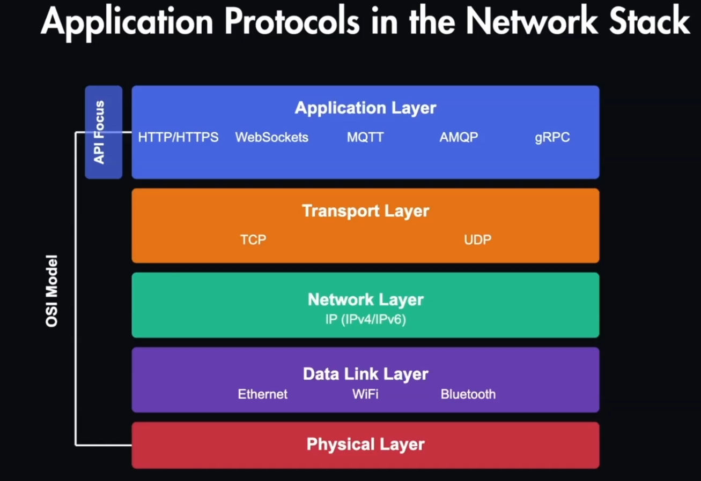

From the images above we can clearly see that we go back to some network foundamentals which is the **OSI MODEL** and our focus is mainly on the application layers where lies all this protocols like **HTTP/HTTPS,Websocket,gRPC** and others which communicate with other layers in the OSI Model.
The most common protocol of communication used is **HTTP(Hyperext Transfer protocol)** which ensures direct communication between server and client we also have https which is just a secure http,HTTP is well documented with error response and code for each types of requests. HTTP also define the host on which the are the version of API and when handle authentification using tokens.After all this we get a response of our HTTP Request which always have a same Format. 

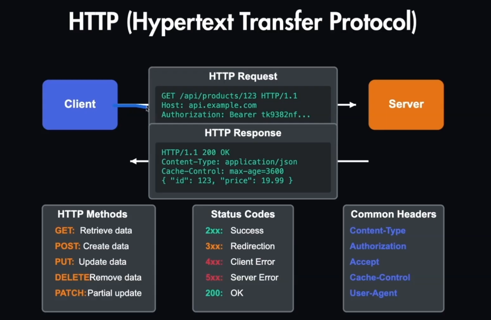

**HTTPS** is like classic HTTP but we some TSL/SSL Encryption and HTTPS stands for **Hyperext Transfer protocol Security**.So this the simple usedof HTTP but adding so TSL/SSL security layers on it to encrypt our data.With it we gain dataencryption and data security compare to the classic http here we gain security.

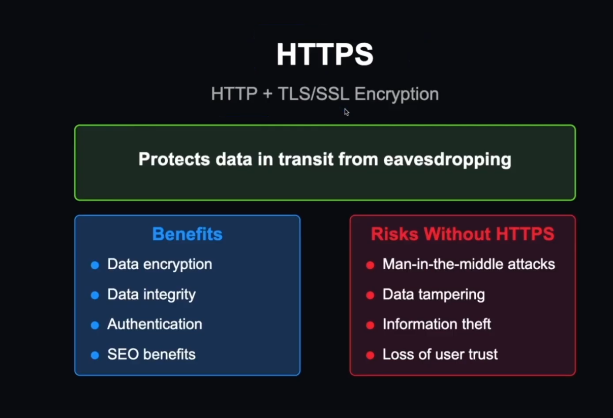

**WebSockets**
When Using HTTP Requests we need to return a specific informations and so in the case we make many requests from our server to our client we mainly waste resource and bandwidth and this is not good in real-time fast communication and thatwhere WebSocket comes in with the use of **WebSocket HandShake** which can acts and a fully continue connection between the client of the server so the are linked together so that the requests we will send in Real time whihc wmainly avoids latency for Real-time Communication.

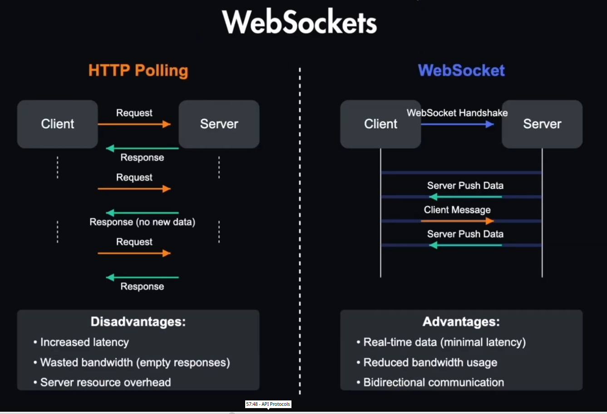

**Note: With WebSockets the server can independly push data to the main client machine.So Websockets enables directional communications**

**AMQP(Advance Messaging Query Protocol)**

This is an advance Enterprise messaging protocol.This can mainly be when update from the images below

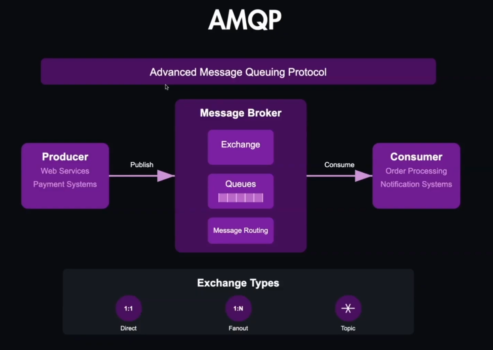

That is a producer make a message that is been stored inside the Queues and when the customers is free he can obtained or collect that piece of informations this process go only in a either **1:1 Relationship** or a **1:N Relationship** or even sometimes **Topics**

**gRPC(Google Remote Proceduce Call)**
This is a highly performance Protocol created by Google which uses the **HTTP/2** for making performance requests can data calls mainly used in Microservices and Real-time Services in modern app Today.
This is also mostly commonly used between Servers to Servers.

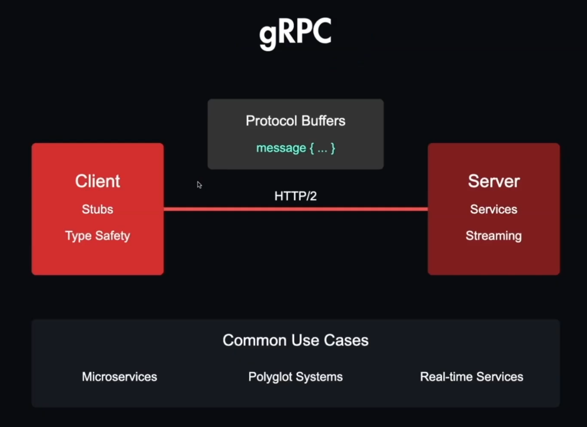

That is mainly all about API protocols and their choose mainly depends on what we are building like if we only need an **E-commerce app good For HTTPS** for a **Real-time Chat app better used Websockets**

# Transport Layer(UCP,TCP)

All this proctols are good but need to be handle from one source to another so this is where the TCP/UCP enters in scene in the handling of the communications between this layers.TCP and UDP are both transport layers protocols that is used for data transfers but that both have their methods of data transfers and sharing.Let start with TCP

**TCP stands for transmission control protocol** which is more simple than UCP in the transport of data.It uses ordered packets and Guaranteed delivery and also have Error checking.Sometimes data are been communicated using **Connection-based(3-ways handshake)**

**UDP(User Datagram Protocol)** Which is the second type of protocol been used here it is very fast but is also not guarented so it does not garanty that the packets will be transfer from the source to the destination like TCP does and i also has less Overhead.The is also no handshake with UDP.UDP can be consider as the gold tool protocol for Real-time connections like **Video Calls**

This is the illustration
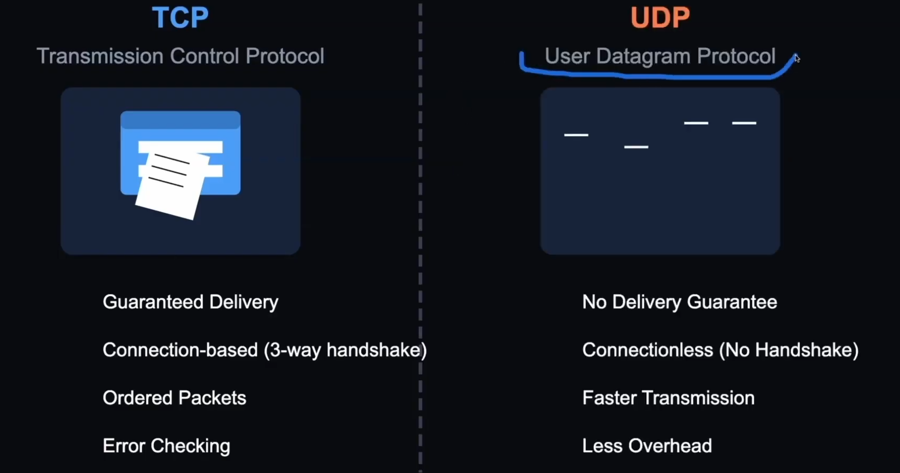

The next images will give us the clear between differcent TCP and UDP and we can clearly see that UDP is a faster but non-secure version of TCP.

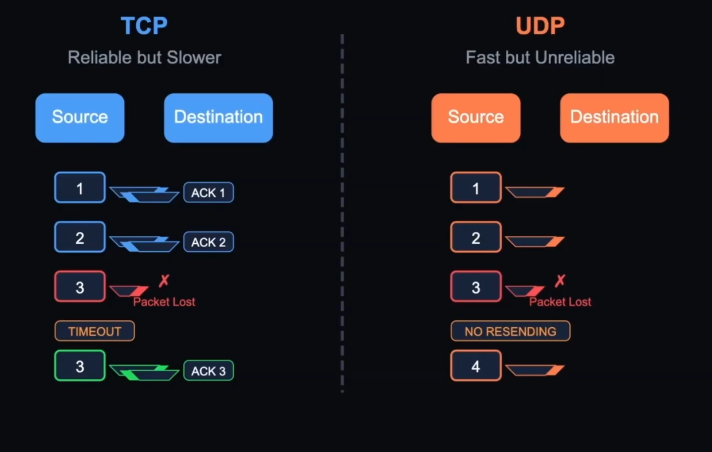

From this we can clearly see that is the use of TCP can is for slower but more secure services like **Banks,Emails and Paiement Systems** while UDP is mainly used Systems like Video gamings,calls and streaming.

# RESTful APIs

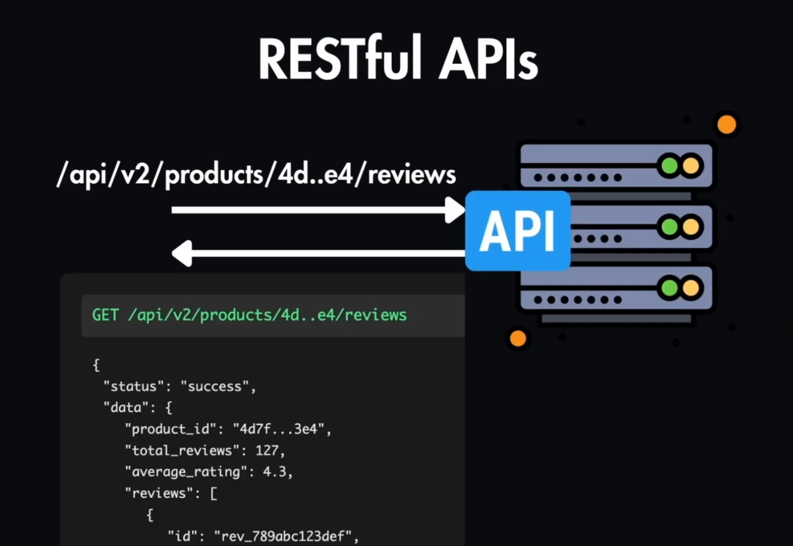

Restful APIs are the more useful formed of API used in developpement today be dev and we gonna explained more on how the are been built.Here i'm mainly talking about this APIs architecture,how it used for error handling,it status code gestion and even it resources modeling.

Let start by seeing the login behind the resource modeling in Resful APIs mainly with the simple business domain which functions with a **Product,Order and Review**.This simple Business Domain is been Transform into a fully Functional RestAPI as can we see on the image below :

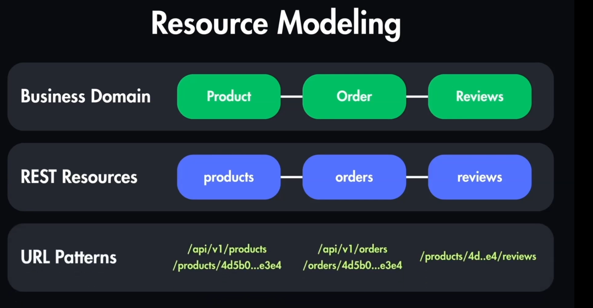

From the image above we can clearly see that in the Rest Resources are been represented as nodes.When designing our API we need to define clear URL_Pattern that will either go fetch or create Data in particular and not extral one.
That is the main reason we add filtering,sorting and pagination into our real world APIs.In other to return specific data.

For Filtering we can refers to the following image when by a user deside to filter and Item by category.So looiking for a Book in stock.
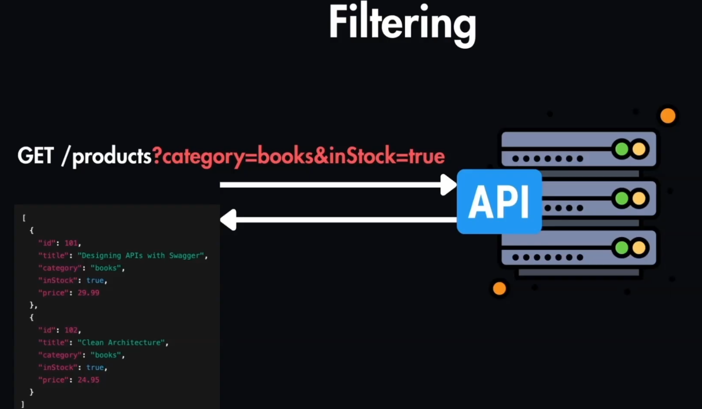

All this methods follows the same pattern let it be sorting,pagination and filtering the are all company by a query parameters as we are seeing on the differcent images  and this query paramter always has a **?+method**

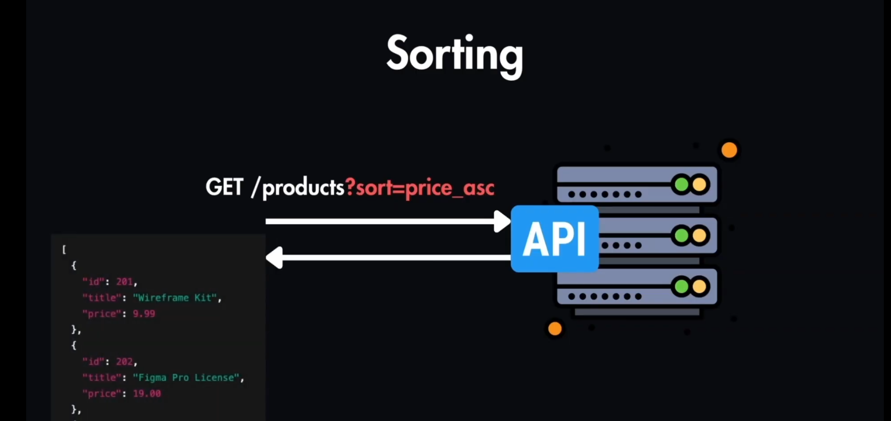

Let consider i want a item let say bag with a price of 1000 so we gonna used sorting to search of that item base on it known price.**Note the sorting functionality is been set up to the backend and not the front since it is a request which aim is to return an a price so can have many items with that price.**

**Pagination** is been used to handle page changes on our site or app it still used a query paramter.Paginatiion is been set up of with a limit to not display all the informations directly to the Frontend like moving only from page 1 to 3 and then from page 3 to 5 but not from 1 directly to 20 using paginations.In some cases pagination is not used as main attribute and replace by **Offset**

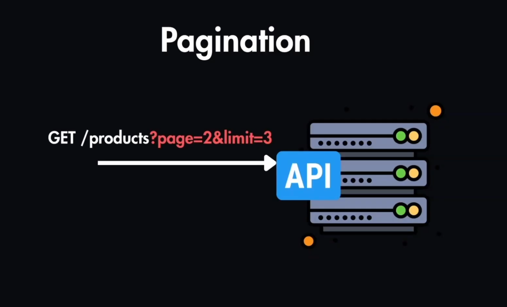

Filtering,Sorting and pagination comes with  some benefits like performance increase,Bandwidth save, and Also gives more flexibity to the frontend.

Now let move on to the used of HTTP protocols,Previously we have seen that this methods mainly relies like **GET,POST,PATCH,DELETE** and more this can be seen in the image below.This methods are mainly sued for Crud opretions.As a dev theused  and role of each of this methods should be sure a simple think or aspect we need to know like :

1. GET(Used to fecth data)
2. POST(Used to create Data)
3. PUT(Used to replcae Data)
4. PATCH(Partial Data Replace)
5. DELETE(Remove Data)

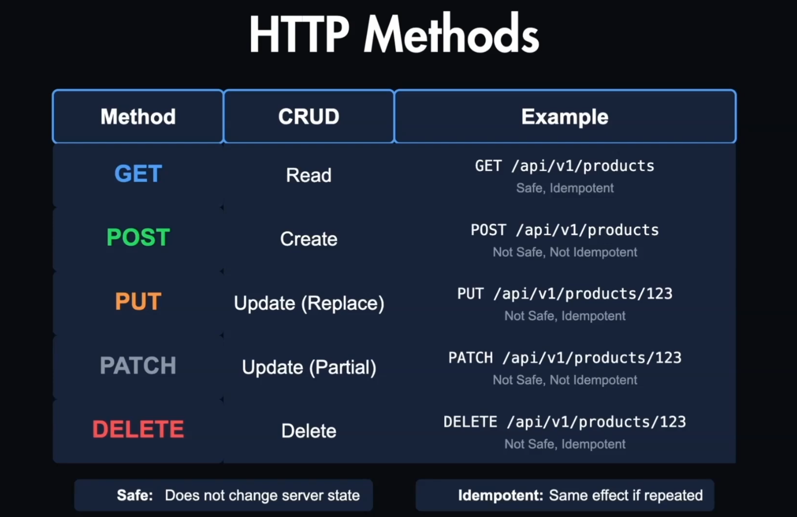

The next image will clearly explained the used of Status code when using RestAPIs which means each request response should carry a code the user to know what happen and so if the requests was succesful or not.Like code **200** means the operation is successful **201** means creation is succesful **204** means No content 

Generally i have the most common errors like the **404(Not Found) and the 500 Internal Server ERROR which generally comes from the DB in Prods**.They are more request errors we gonna see and explain with this screenshot 

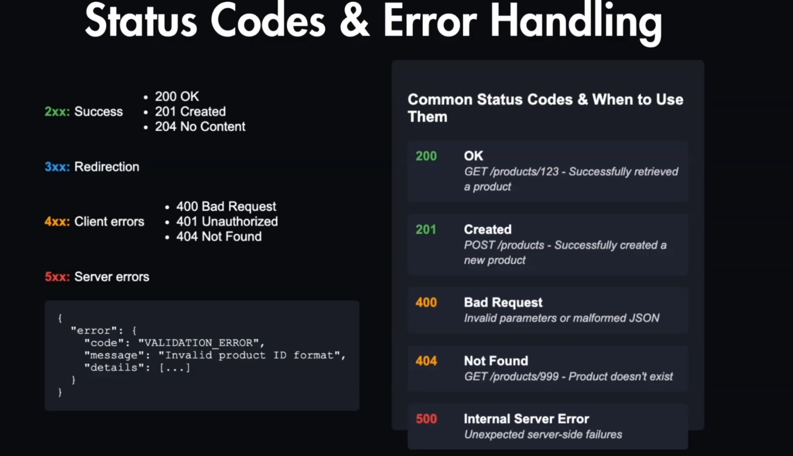

As can see the 300 series are mainly Redirections while the **400 Serries are mainly Client Errors**

When Using Restful APIs the some best practices a users needs to respect to build a good APIs for everything one to understand.

1. The used of Plusral nouns for api route naming
2. APIS versoning 
3. Ensure our APIS Support pagination,Filtering and Sorting 
4. Also keep our URL hierachy constsistence and constans

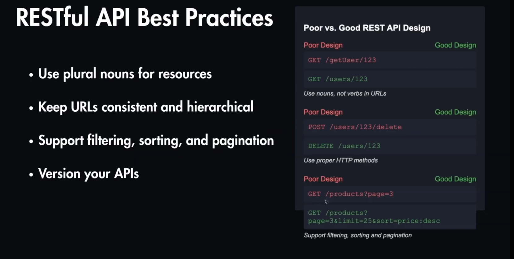

From the above images we can clearly see how a good restful API should be designed or made up.

# GRAPHQL

Traditional RestfulAPIs either return too low or too much about of data when we do a request using it them.GraphQL solve this issue by giving client exactly what the need after doing their request so the have an exact Request response to their requests.So this Session is mainly base on the use and understanding of GRAPHQL in the world of modern softwares.GRAPHQL API was created by facebook in other to solve the issues of many requests with clients which needed more specification on their output requests.Sometime users can make multiple request to the same API and still not receive all the data so the end up making more and more requests which turn up increasing the system latency and saturating the **APIs endpoints** so GRAPHQL solve this issue.We can Clearlt see that in the images below.

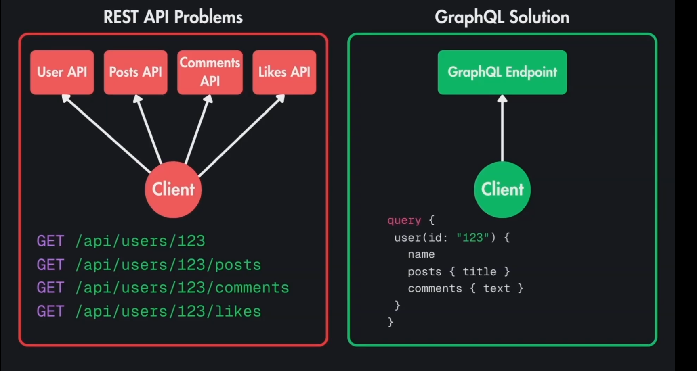

So with GRAPHQL facebook energineer simply modified the form of the request while also changing the format from multiple endpoints to a single one.That is searching an exact book inside a library.
**So with GRAPHQL** we mainly change the schema our request and the mainly look like json objects which was mainly the format of the response in Restful APIs.The methods are in the image below.

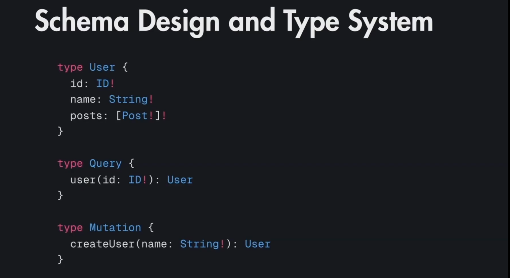

**Note: With GRAPHQL we need to return error skills in the query in order for it to return and error if it encountes one**

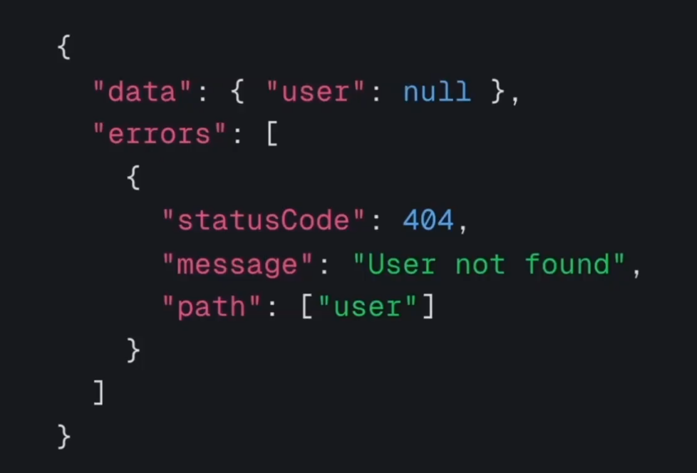

# Authentication

**Authentication is the system that permit to know if a user is been able to access a particular service he claims to it** Thats is the aim used if Auth Servers in our applications.Most developpements mix up Authentication with Authorization also very confuse we JWT and OAUth2 which is an Authentication Framework while JWT and Bearer Auth are Authentication methods.

Let start up with an illustrative message that defines authentication.

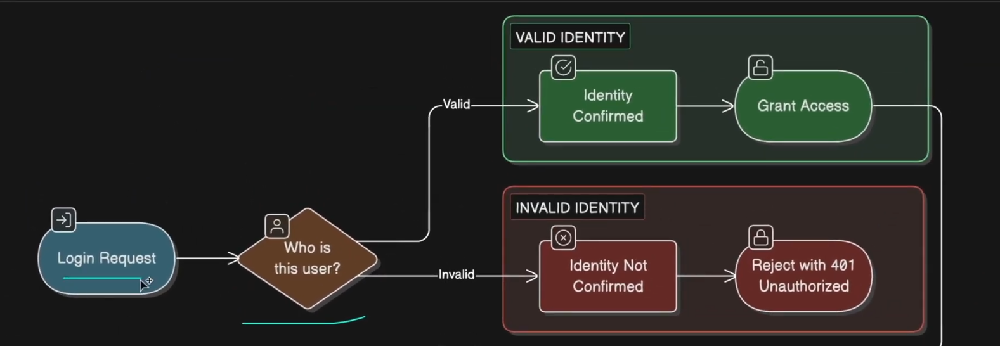

From the image we can clearly see that when a user login  the auth server ask him who is he and to what try of services he can access. If we faces a valid user then he is granted access to the system ou our app else the user is been rejected and send back to an error code **401 UnAuthentized** 
We have many types of authentication systems that we gonna view in this course directly from the following image below.

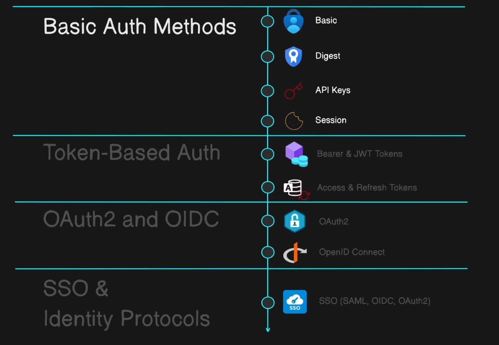

From the images we can see some caterogories of Authtications methods that is :** 
1. **Basic Auth Systems**
2. **Token Base-Auth Systems**
3. **OAuth2 and OIDC**
4. **SSO & Identity Protocol**

Let start with the Basic Auth_Systems 
- **Basic Auth Flow**: This method is quite simple an easy but it only secure with https  and it also easily reversible.
- **Digest Auth Flow**: This methods works similar to the other Basic Auth System but uses **MD5** hashing system in other to hash the server response.This is better and more secure than the basic auth but it seen none to secure and mainly **Outdated today in prod**
- **APIkey Auth Flow**: This is when we generate a unique key for each client and then the send that key during each request to be granted acces to the services.This API keys are been stored into database into hashed form so the users can get the same keys for each connection since these keys already exist in database.If the API key is been missing we just returns a Bad Request.**This is the same system AI teach companies uses with our APIs keys and if that key leaks youwill expose to hackers.**
- **Session Base Auth** :Let you an image to describe the whole process.

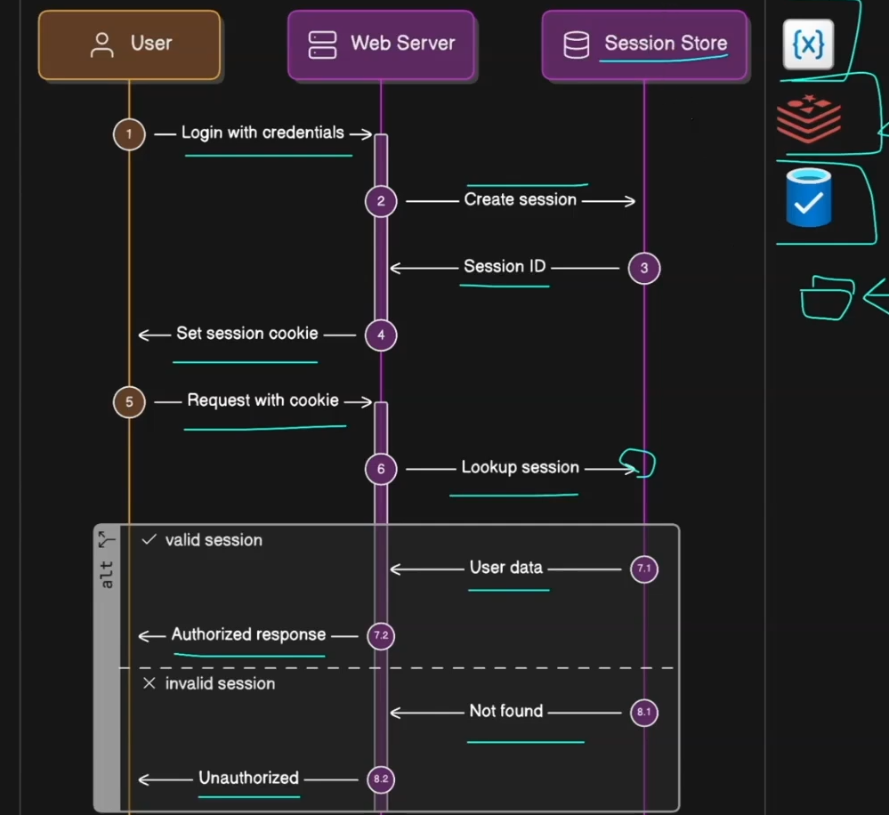

**2. Token Base Auth Systems**

